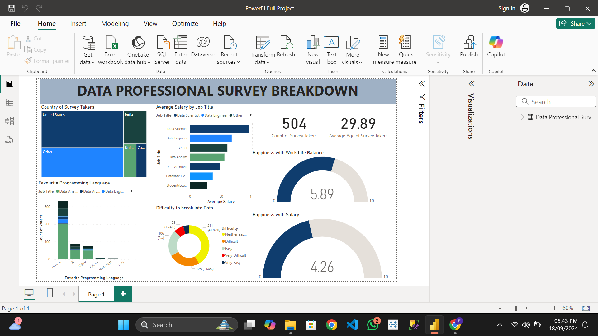

## Okoronkwo Francis Ifeanyi - Data Analytics Professional

I am a **Data Analytics Professional** with a background in **Agricultural and Bioresources Engineering**. My experience spans across several data-centric projects, showcasing my expertise in tools like **Excel**, **Power BI**, **SQL**, and **Python**. I have worked on various projects including data cleaning, exploration, visualization, and automation.

### Skills:
- **Data Analysis & Visualization**: Proficient in Excel, Power BI, Tableau for creating comprehensive reports and dashboards.
- **SQL**: Experienced in writing complex SQL queries for data extraction, cleaning, and transformation.
- **Python**: Skilled in using Python for automation, data analysis, and web scraping.
- **Project Management**: Demonstrated ability to manage and deliver data projects on time with clear documentation.

# Data Analytics Portfolio Projects

Welcome to my data analytics portfolio! Here, you'll find a collection of projects showcasing my skills in Excel, Power BI, SQL, Python, and Tableau. Each project includes code, data, and visualizations that highlight different aspects of data analytics, from data cleaning and exploration to dashboard creation and machine learning.

---

## 1. Tableau Project: Airbnb Data Visualization

This project provides insights into Airbnb data, including bookings, pricing, and location trends. Click the image below to explore the interactive Tableau dashboard.

---

## 2. Excel Project: Complete Sales Performance Analysis

- **Project Link**: [Excel Complete Project](https://github.com/Francisroyce/PortfolioProjects/blob/main/Excel%20Complete%20Project.xlsx)
- **Description**: This project focuses on sales performance analysis using Excel, utilizing formulas, pivot tables, and charts to extract insights.
- **Skills Demonstrated**: Excel formulas, Pivot Tables, Data cleaning, Data visualization.

---

## 3. Power BI Project: Retail Sales Dashboard

- **Project Link**: 
- **Description**: A Power BI dashboard analyzing retail sales data, providing insights into sales performance, customer segmentation, and trends.
- **Skills Demonstrated**: Data modeling, DAX formulas, Power BI visualizations, KPI analysis.

---

## 4. SQL Project: COVID Data Exploration

- **Project Link**: [COVID Portfolio Project - Data Exploration SQL](https://github.com/Francisroyce/PortfolioProjects/blob/main/COVID%20Portfolio%20Project%20-%20Data%20Exploration.sql)
- **Description**: This SQL project focuses on exploring COVID-19 data, querying databases to uncover trends and insights.
- **Skills Demonstrated**: SQL querying, Data extraction, Aggregations (SUM, AVG), Filtering.

---

## 5. SQL Project: Data Cleaning

- **Project Link**: [Data Cleaning SQL](https://github.com/Francisroyce/PortfolioProjects/blob/main/DATA%20CLEANING.sql)
- **Description**: This project involves cleaning a messy dataset using SQL queries, removing duplicates, handling missing data, and standardizing fields.
- **Skills Demonstrated**: Data cleaning with SQL, JOINs, Data manipulation.

---

## 6. Python Project: Automatic File Sorter

- **Project Link**: [Automatic File Sorter in File Explorer](https://github.com/Francisroyce/PortfolioProjects/blob/main/Automatic%20File%20Sorter%20in%20File%20Explorer.ipynb)
- **Description**: A Python project that automates the sorting of files into different folders based on their extensions.
- **Skills Demonstrated**: Python scripting, File handling, Automation.

---

## 7. Python Project: BMI Calculator

- **Project Link**: [BMI Calculator](https://github.com/Francisroyce/PortfolioProjects/blob/main/BMI%20CALCULATOR.ipynb)
- **Description**: A Python project to calculate the Body Mass Index (BMI) of individuals based on their height and weight.
- **Skills Demonstrated**: Python functions, User input handling, Data validation.

---

## 8. Excel Project: Formula Tutorial

- **Project Link**: [Excel Formula Tutorial](https://github.com/Francisroyce/PortfolioProjects/blob/main/EXCEL%20FORMULAR%20TUTORIAL.xlsx)
- **Description**: This project includes a comprehensive tutorial on commonly used Excel formulas and functions.
- **Skills Demonstrated**: VLOOKUP, IF statements, COUNTIF, SUMIF, and other advanced Excel formulas.

---

## 9. Python Project: Mini Web Scraping Project

- **Project Link**: [Inspecting a Web Page (Web Scraping)](https://github.com/Francisroyce/PortfolioProjects/blob/main/Inspecting%20a%20Web%20Page_scrapping.ipynb)
- **Description**: A mini web scraping project that demonstrates how to inspect a webpage and extract information using Python libraries such as BeautifulSoup.
- **Skills Demonstrated**: Web scraping, BeautifulSoup, Python scripting.

---

For a complete overview of all projects, feel free to explore the [Portfolio Projects Repository](https://github.com/Francisroyce/PortfolioProjects).

